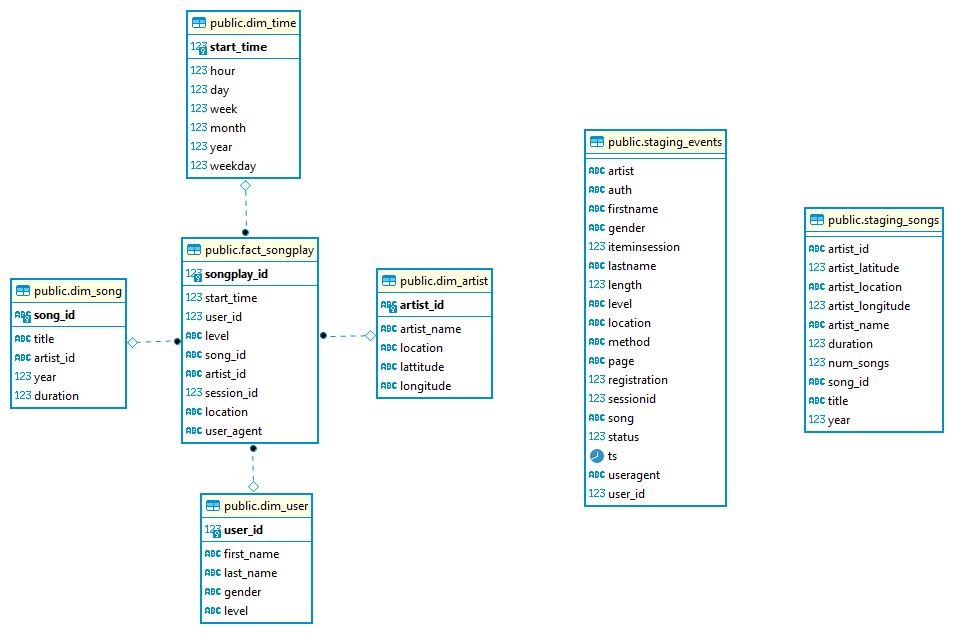

# Project: Data Warehouse

------------------------------------------
### Purpose of database
The database sparkydb mainly created for Sparkify analytics team to help them to run some sql queries on data to find out some pattern and get an overall overview of the data taht residing in Amazon S3.

--------------------------------------------
### Databaase schema
The following diagram show the star schema used for the starSchema and the staging tables used in this project 

   

#### Fact Table 
1. **fact_songplay** - records in log data associated with song plays i.e. records with page `NextSong` 
    + *songplay_id (PK), start_time(FK) , user_id(FK) , level, song_id(FK) , artist_id(FK) , session_id(FK), location, user_agent*

#### Dimension Tables 
2. **users** - users in the app 
    + *user_id (PK), first_name, last_name, gender, level*

3. **songs** - songs in music database
    + *song_id (PK), title, artist_id, year, duration*

4. **artists** - artists in music database
    + *artist_id (PK), name, location, lattitude, longitude*

5. **time** - timestamps of records 
    + *start_time (PK), hour, day, week, month, year, weekday*

--------------------------------------------
### Project Structure 
this project includes the following files:
+ `sql_queries.py` - this python file contain all database querys definition in a string format used for creating tables, inserting data and deleting tables ;
+ `create_tables.py` - This python script will delete tables (if exist) and create (re-create) new tables in redshift cluster (getting redshift config data from dwh.cfg);
+ `etl.py` - a python script to load data from s3 into stagings tables and then inserting data from staging tables to the data warehousing tables  ;
+ `dwh.cfg` - config file for the redshift cluster and s3 data;
+ `resources_dwh.txt` - Contain most of the websites i have used to help me in this project;

--------------------------------------------
### Running procedure

To create the `sparkifydb` database and tables, we need to run `python create_tables.py` from the Terminal, after success we need to run `etl.py` to load data from s3 to staging tables and then to datawarehouse tables (star schema). 